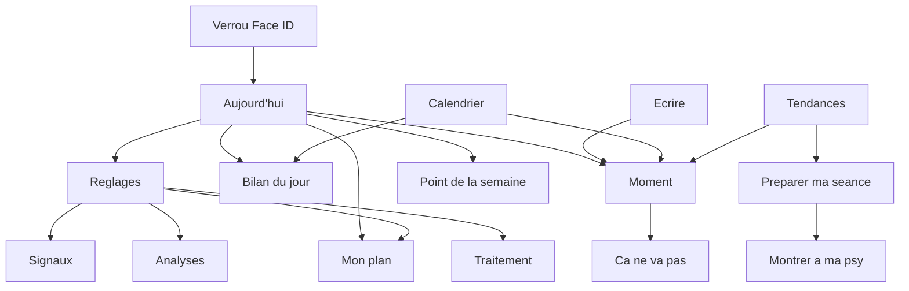

# Cartographie des écrans

Hors de l'accueil. Chaque écran s'ouvre en page plein écran, avec le bouton Retour. Le partage d'un fichier et l'import JSON restent les feuilles du système.

## Verrou

S'affiche par-dessus tout à l'ouverture, si Face ID est allumé. Symbole Face ID, le nom Polar, bouton **Ouvrir**. Le code de l'iPhone sert de repli. Un délai de grâce se règle dans Réglages : immédiat, 1 min, 5 min ou 15 min. L'écran se floute dans le sélecteur d'apps si ce réglage est allumé.

## Calendrier

Onglet. Titre du mois, ou de l'année si on pince. Flèches pour changer de mois. Les semaines commencent le lundi. Chaque jour montre l'humeur haute qui monte et l'humeur basse qui descend. Un jour sans bilan reste vide.

Toucher un jour ouvre le **bilan** de ce jour.

Le bouton crayon de la barre d'onglets ouvre un **moment**, comme sur les autres onglets.

## Tendances

Onglet. Titre **Tendances**. Période : 30 jours, 90 jours ou 1 an.

- **Préparer ma séance** ouvre cette page.
- Life chart, courbe de sommeil, questionnaires, constats, émotions les plus fréquentes, comparaison de deux mesures, recherche dans les notes, résumé de la semaine.
- Export : PDF du mois, avec ou sans les pensées, CSV, JSON. Le partage passe par la feuille du système.

En mode discret : « Courbes masquées. Tes notes continuent. » Le calendrier, lui, reste visible. La pause du suivi coupe les signaux, pas cette page.

## Moment

Page **Moment**. On y arrive par le crayon, par un moment déjà noté, par le bouton + des autres onglets, par Siri, le bouton Action ou un raccourci de l'icône.

Tout est sur la même page. Rien n'est obligatoire.

- Émotion, puces récentes, **Plus…** pour le catalogue, **Autre** pour un mot libre.
- Intensité de 0 à 10, si une émotion est choisie.
- **C'est lié à…** : travail, famille, et le reste.
- Pensée, avec des amorces et le micro pour dicter.
- Comportement, avec les puces réglables.
- **Terminé** revient en arrière. Toast « C'est noté. » si les trois champs sont là, sinon « À compléter quand tu veux. »

Si la pensée contient un mot de détresse, une carte **Ton plan de sécurité est là** ouvre **Ça ne va pas**.

## Bilan du jour

Page **Bilan du jour**. Depuis la carte de l'accueil, un jour du calendrier, ou le rappel du soir.

Sous-titre : « Le niveau le plus fort de la journée ». Le cercle vide rappelle le niveau d'hier.

Selon les points activés dans Réglages :

- Humeur basse, humeur haute, irritabilité, anxiété : aucun, léger, modéré, sévère.
- Énergie, de −2 à +2 par rapport à d'habitude.
- Sommeil, heures et minutes, prérempli depuis Santé s'il y en a, avec l'heure du coucher et du lever.
- Signes remarqués, repris de Mon plan.
- Rythme du jour : premier contact, début d'activité, dîner.
- Facteurs : un toucher ajoute 1, un maintien remet à 0.
- Symptômes psychotiques, poids, séance avec ta psy, points personnalisés.
- Traitements du jour : pris, et un changement de dose.
- Note du jour.
- Lumière du jour, si une position a été demandée.
- Les moments de ce jour, en lecture.

**Terminé** revient en arrière. La saisie est déjà enregistrée.

## Point de la semaine

Page **Point de la semaine**. Carte sur l'accueil le jour choisi, si le réglage est allumé et que le point n'a pas été fait.

Questions une par une, avec le compte « 1 / n ». PHQ-9 et ASRM. GAD-7 en plus si le réglage est allumé. À la fin : « C'est noté. » et le score de chaque questionnaire. Ces scores vont dans le rapport pour ta psy.

## Préparer ma séance

Page **Préparer ma séance**. Depuis Tendances.

Résumé depuis la dernière séance cochée, ou les 30 derniers jours.

- Période : « Depuis le … »
- Un paragraphe factuel, seulement si l'IA sur l'appareil est allumée.
- Life chart de la période.
- Faits : sommeil, humeur, énergie, traitement.
- Scores des questionnaires, avec le score précédent.
- Moments marqués « à en parler ».
- Tes questions, à ajouter ou retirer.
- **Montrer à ma psy** ouvre un écran plein, sans le reste de l'app, pour poser le téléphone.

## Ça ne va pas

Page **Ça ne va pas**. Depuis un mot de détresse dans un moment, Siri, le raccourci de l'icône, ou l'intent dédié. Pas depuis l'accueil. Reste accessible en mode discret et pendant une pause du suivi.

Plan de sécurité en six étapes.

1. Mes signes d'alerte.
2. Me calmer seul.
3. Personnes et lieux qui apaisent.
4. Qui peut m'aider.
5. Professionnels et urgences.
6. Rendre mon environnement sûr.

En haut : ce qui compte pour moi, et la date si tu as marqué « relu aujourd'hui ». Boutons pour appeler ou écrire. « Rien ne part sans toi. » Le 15 et le 3114 sont proposés.

## Mon plan

Page **Mon plan**. Depuis Réglages, ou **Voir mon plan** sur une carte de signal.

Deux pôles, « Quand ça monte » et « Quand ça descend », et deux paliers, « Premiers signes » et « Ça s'installe ». Pour chacun : tes signes et ce que tu fais. Les signes repris d'une ancienne version sont dans **À classer**.

Section **Contacts**. Les signaux d'alerte se règlent ici aussi : aucun seuil n'existe tant que tu ne l'écris pas.

## Réglages

Page **Réglages**. Engrenage sur l'accueil.

| Section | Contenu |
|---|---|
| Traitements | Liste, **Ajouter**, et **Analyses** si ce point est suivi |
| Points suivis | Humeur, énergie, rythme, facteurs, analyses, symptômes, poids, séance, points à toi |
| Point de la semaine | Activer, jour, toutes les deux semaines, GAD-7 |
| Signaux | **Régler les signaux** |
| Affichage | Mode discret, pause du suivi pendant 14 jours |
| Rappels | Bilan du soir, heure, textes neutres sur l'écran verrouillé |
| Journée | Heure à partir de laquelle un nouveau jour commence, 0 à 10 |
| Mon plan | Ouvre Mon plan |
| Confidentialité | Face ID, délai de grâce, flou, iCloud |
| Santé | Écrire les émotions, autoriser l'accès |
| Compagnon | Phrases, IA sur l'appareil |
| Apparence | Toujours clair, suivre le système, nuit automatique |
| Puces de comportement | Liste, retour aux puces d'origine |
| Données | Importer un JSON, demander la position pour la lumière du jour |
| Ressources | 3114, FondaMental, Psycom, Argos 2001, Unafam |

### Traitement

Page **Traitement**, ou le nom du médicament. Nom, dose, moment (matin, midi, soir, au besoin), rappel. **Enregistrer**. Un traitement déjà créé peut être archivé, pas effacé.

### Analyses

Page **Analyses**. Visible si le point est activé. Ajouter une analyse : nom, valeur, unité, date. Historique en dessous. Aucune interprétation.

### Signaux

Page **Signaux**. « Rien n'est pré-rempli. Un signal montre un fait, jamais un risque calculé. » Liste des signaux actifs, et le formulaire pour en ajouter un : type, seuil, nombre de jours.

## Montre

Deux écrans, l'un après l'autre. D'abord **Émotion** : Calme, Joie, Anxiété, Tristesse, Colère, Épuisement. Puis **Intensité** : 2, 5 ou 8. « C'est noté. » Le moment arrive sur l'iPhone.

## Widget

Pas une page de l'app. Une grille d'émotions sur l'écran d'accueil. Un toucher enregistre l'émotion seule, à compléter plus tard.

## Raccourcis de l'icône

Appui long sur l'icône Polar, sans ouvrir l'app d'abord.

- Nouveau moment
- Bilan du jour
- Ça ne va pas
